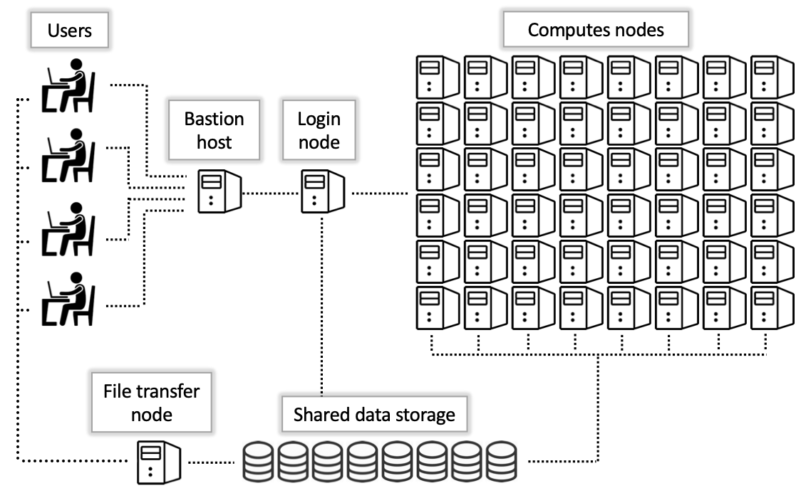

<link rel="stylesheet" href="../../assets/stylesheets/buttons.css">


# Compute Nodes and Interactive Jobs 

### The Compute Nodes

Unlike the bastion host and login nodes, there are many compute nodes and each has, as the name suggests, a large amount of computational resources available to run your work. For example, Puma standard nodes have 94 available CPUs and a whopping 470GB of RAM. 

<center></center>

To get a sense of what the cluster looks like, try running the command ```nodes-busy```. This should look something like:

```
✚    Buy-in nodes. Only accept high_priority and windfall jobs
(puma) [sarawillis@wentletrap ~]$ nodes-busy 
==============================================================

                      ▒ System Status ▒
              Wed Feb 14, 03:42:09 PM (MST) 2024

Standard Nodes
==============================================================
r1u16n2  :[▒▒▒▒▒▒▒▒▒▒▒▒▒▒▒▒▒▒▒▒] 100.0%   
r1u17n2  :[▒▒▒▒▒▒▒▒▒▒▒▒▒▒▒▒▒▒▒▒] 100.0%   
r1u18n1  :[▒▒▒▒▒▒▒▒▒▒▒▒▒▒▒▒▒▒▒▒] 100.0%   
r1u25n1  :[▒▒▒▒▒▒▒▒▒▒▒▒▒▒▒▒▒▒▒▒] 100.0%   
r1u26n1  :[▒▒▒▒▒▒▒▒▒▒▒▒▒▒▒▒▒▒▒▒] 100.0%   
r1u26n2  :[▒▒▒▒▒▒▒▒▒▒▒▒▒▒▒▒▒▒▒▒] 100.0%   
r1u27n1  :[▒▒▒▒▒▒▒▒▒▒▒▒▒▒▒▒▒▒▒▒] 100.0%   
```

Each line shows one compute node on the cluster you're connected to and how busy it currently is running jobs. By default, when you first log in you're connected to the Puma cluster. This is the largest and newest and generally provides the most in terms of computational resources. However, we have two other clusters available: Ocelote and ElGato, each with a good number of computational resources available and shorter wait times to access them. 

When you first connected to a login node in the previous section, your terminal should have displayed:

```
 ***
The default cluster for job submission is Puma
***
Shortcut commands change the target cluster
-----------------------------------------
Puma:
$ puma
(puma) $
Ocelote:
$ ocelote
(ocelote) $
ElGato:
$ elgato
(elgato) $
-----------------------------------------

```

This shows you the various shortcuts you can use to connect to the different clusters. Try running the command ```elgato``` now. You should see a change in your terminal prompt to indicate that your cluster has changed. 

```
(puma) [user@wentletrap ~]$ elgato
(elgato) [user@wentletrap ~]$ 
```

Now that you've switched clusters, you're ready to try running some work. 

### Job Charging

Before you connect to a compute node, let's quickly cover job charges. 

Every HPC group gets a free allocation of CPU hours that they can spend every month to access compute resources. You can think of a CPU hour as a token to buy one CPU for one hour, so if you want to reserve 5 CPUs for 10 hours, this will charge 50 CPU hours to your account. You can see more detailed information on job queues, allocations, and job charging on our [Time Allocations](../../running_jobs/allocations/) page which has a comprehensive breakdown.

For this tutorial, we'll focus on the standard partition. This is a job queue and is the one that consumes your standard allocation. To use this job queue, you'll need to know your account name. To check, use the command ```va``` which stands for "view allocation". The output will look something like:

```
(elgato) [user@gpu5 ~]$ va
Windfall: Unlimited

PI: parent_974 Total time: 7000:00:00
    Total used*: 1306:39:00
    Total encumbered: 92:49:00
    Total remaining: 5600:32:00
    Group: group_name Time used: 862:08:00 Time encumbered: 92:49:00

*Usage includes all subgroups, some of which may not be displayed here
```

You should see a name next to the ```Group``` field (in the example above ```group_name```). If you see multiple groups, then you are sponsored in multiple groups and can choose any one of your group names. Note the name of your account and hang onto it for the upcoming sections.

### Interactive Jobs

Now, let's actually access a compute node. When you're connected to a login node, you can connect to a compute node by using the command ```interactive```. The command ```interactive``` by default will give you one CPU for one hour (which will charge your account one CPU hour -- don't worry, you have a lot!). You can adjust this using the different flags available which are documented on our [Interactive Jobs](../../running_jobs/interactive_jobs/) page. For now, we'll stick with the default resources. 

To access a session, run the following, substituting your own group name (that you found with ```va``` in the section above) in for ```group_name```:
```
interactive -a group_name
```

For example, in my case:
```
(elgato) [netid@wentletrap ~]$ interactive -a hpcteam
Run "interactive -h for help customizing interactive use"
Submitting with /usr/local/bin/salloc --job-name=interactive --mem-per-cpu=4GB --nodes=1    --ntasks=1 --time=01:00:00 --account=hpcteam --partition=standard
salloc: Granted job allocation 1800857
salloc: Nodes cpu39 are ready for job
[netid@cpu39 ~]$ hostname
cpu39.elgato.hpc.arizona.edu
```

You'll notice once your job starts that your command line prompt changes to display the name of the compute node. If you run hostname, this should match your command line prompt and show you the name of the compute node you're connected to. in my case, I'm connected to the ElGato compute node ```cpu39```.

You'll also notice that your session has been assigned a job number (in the above, you can see this as ```Granted job allocation 1800857```). A job number is assigned to every job on the system and is used to keep track of job statistics and metrics. This is especially useful for batch jobs which we will cover in a few sections. 


<html>
<div class="button-container">
    <a href="../logging_in"><button class="left-button">&#x25C0; Logging In</button></a>
    <a href="../software"><button class="right-button">Accessing Software &#x25B6;</button></a>
</div>
</html>