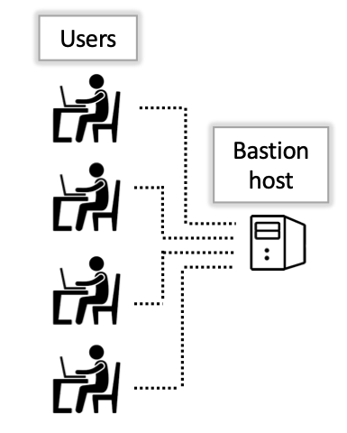
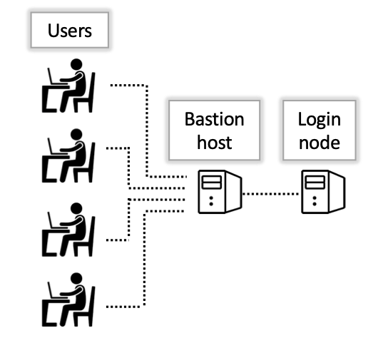

<link rel="stylesheet" href="../../assets/stylesheets/buttons.css">

# Logging In and System Layout

!!! tip 
    If you experience any issues during the login process, [see our FAQs for common problems](../../support_and_training/faqs/account_access/).

HPC systems can sometimes feel a little like a complicated black box and it can be a challenge to know exactly where you are and what the structure looks like. In this section, we'll give you an idea of how the system is laid out so you understand exactly where you are at each stage of the login process and what activities are performed where. 


### The bastion host

In another browser window, open [our instructions on logging in from the command line](../../registration_and_access/system_access/command_line_access/). Start by following the first step shown that's specific to your operating system. Stop when your terminal displays 

```
Success. Logging you in...
Last login:
This is a bastion host used to access the rest of the RT/HPC environment.

Type "shell" to access the job submission hosts for all environments
```
If all has gone well, you are now connected to what is known as the bastion host. 

<center></center>

The bastion host is the first computer you land on when you log in using the hostname ```hpc.arizona.edu```. This machine is only used to validate your credentials and provide a gateway to the rest of the HPC environment. It is not used for storing files and has no software installed so no computational work is done at this stage. As a test, try running the command ```hostname```:

```
[user@gatekeeper 14:50:49 ~]$ hostname
gatekeeper.hpc.arizona.edu
```

The output shows ```gatekeeper``` which is the name of this node and is how you can tell you're connected to the bastion. 

Next, to leave the bastion host, type the command ```shell```.


### The login nodes

After you type ```shell``` on the bastion host, you're connected to a computer called a login node. 

<center></center>

We have two of these available and you will be assigned one at random. If you run the ```hostname``` command as you did on the bastion host, you should see either ```wentletrap``` or ```junonia```. 

A login node is a shared workspace designed for managing files, writing scripts, submitting and monitoring jobs, viewing system resources, and selecting your target cluster. These are small machines and have minimal computational capabilities and very little software installed. They are not the place where computational work is done so users should not run their analyses, compile their software, or perform computationally intensive work in this location. Instead, analyses should be performed on a compute node. A compute node can be accessed in an interactive job. 


<html>
<div class="button-container">
    <a href="../common_misconceptions"><button class="left-button">&#x25C0; Common Misconceptions</button></a>
    <a href="../interactive_jobs"><button class="right-button">Interactive Jobs &#x25B6;</button></a>
</div>
</html>
