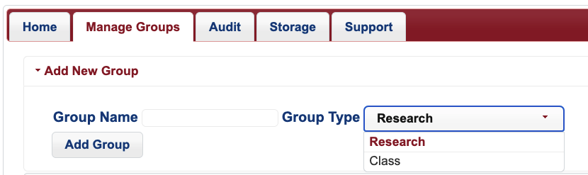
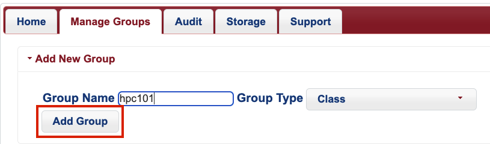
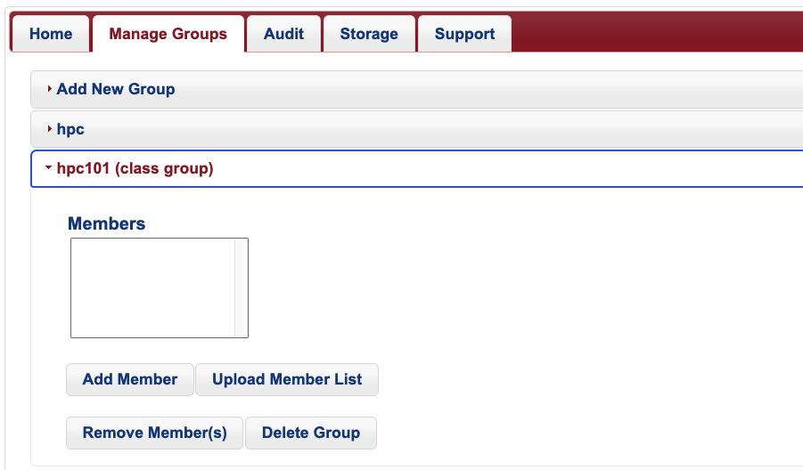

# Class Groups

!!! tip 
    If you are interested in having an HPC staff member come to your class to do an Intro to HPC presentation, reach out to our consultants.
    
If you are a faculty member and are teaching a course that makes use of HPC resources, you can create a Class Group that will grant your students system access. Class groups are designed to be created and used for one semester only.

## Creating a Class Group

Log into your [User Portal](https://portal.hpc.arizona.edu/), navigate to the **Manage Groups** tab, and select the **Add New Group** dropdown option at the top of the page.There will be an option to specify your **Group Type** on the right. Choose **Class** from the dropdown menu



Under **Group Name**, enter something descriptive and then complete the process by clicking **Add Group**.



Once this process is complete, you can find your group's dropdown tab under **Manage Groups**. There you can add students either individually or in batch by uploading a CSV file with your student's NetIDs. You may also remove students from the group by clicking their NetIDs and then selecting Remove Member(s), or delete the group itself by selecting Delete Group.



## File Permissions and Storage
Students in your class group will only be able to access files and directories owned by the class group. This means they will not be able to access files and directories owned by your standard research group. 

## Running Jobs and Allocations
Due to Arizona sales tax restrictions, class groups may only using the windfall queue on Puma. However, standard hours may be used by students on Ocelote. To submit standard jobs on Ocelote, students will use the class group's name for the ```--account``` SLURM directive. For example:

```bash
#SBATCH --account=hpc101
#SBATCH --partition=standard
```
Standard hours used on Ocelote are pulled from the same pool as your research group so make sure to plan accordingly. If you run the command ```va```, you will see the class group as being nested under the total time allocated to your primary research group as well as any others you may have created. Students will not see the names of your other research groups if they run va unless they are members. 

```bash
(ocelote) [faculty_netid@wentletrap ~]$ va
Windfall: Unlimited
 
PI: parent_000 Total time: 35000:00:00
    Group: hpc101 Time used: 0:00:00 Time encumbered: 0:00:00
    Group: faculty_netid Time used: 0:00:00 Time encumbered: 0:00:00
    Total used: 0:00:00
    Total encumbered: 0:00:00
    Total remaining: 35000:00:00
```