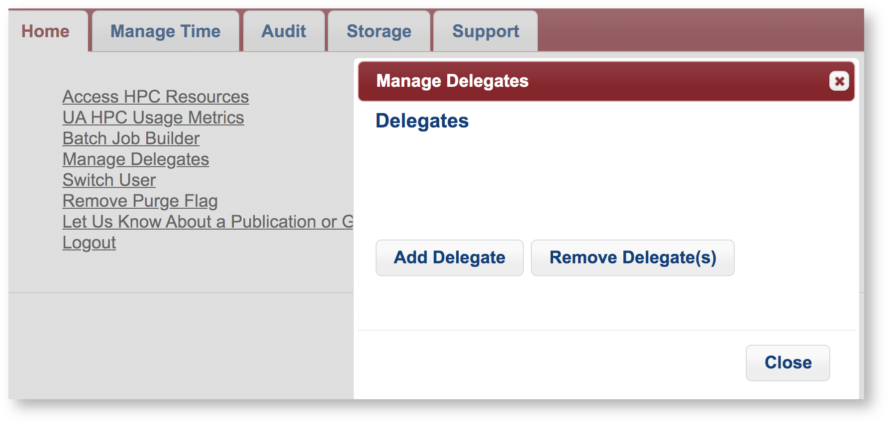

# Delegating Group Management Rights
PI's can delegate management rights to trusted group members. Delegates may create research and class groups, sponsor users, remove users, and request and manage storage offerings on behalf of their faculty sponsor. To add a group member as a delegate, the PI can click the **Manage Delegates** link on the home page of the [user portal](https://portal.hpc.arizona.edu/portal/). In the Manage Delegates window that appears, select **Add Delegate**, enter your group member's NetID, and click **Add**.

Once a group member has been added as a delegate, they can log into the user portal, selecting **Switch User**, enter their PI's NetID in the pop-up field, and click **Switch User**. This will allow them to perform functions on their PI's behalf. They may switch back to their own account at any time by selecting Switch User and entering their own NetID.

