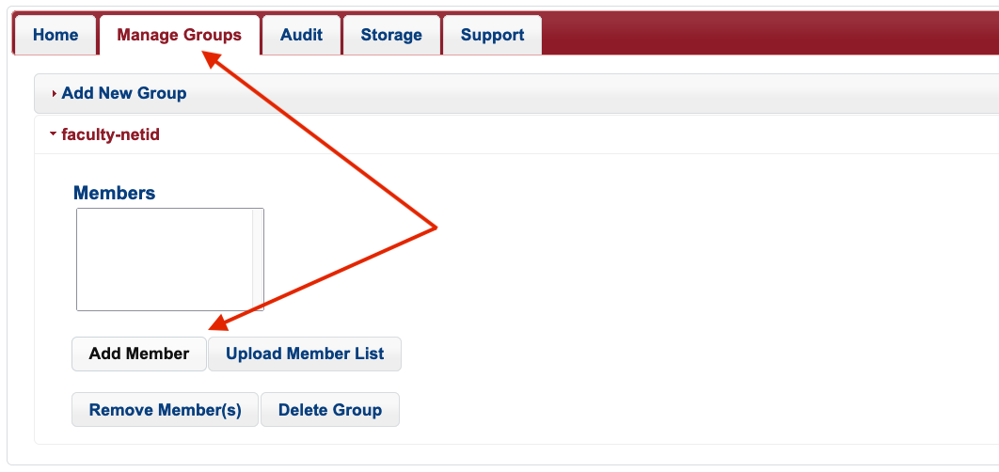
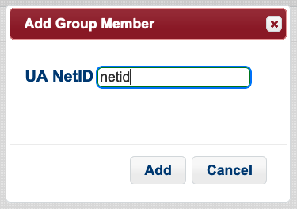
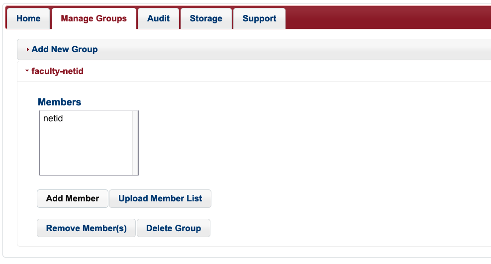
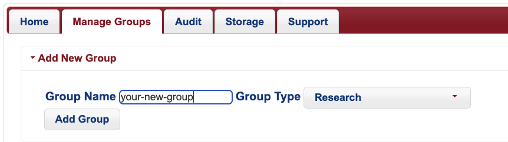

# Research Groups

If you are a faculty member who has [registered for an HPC account](/registration_and_access/account_creation), a research group with your UArizona NetID name has automatically been created for you. This group has [an allocation of CPU hours](/running_jobs/allocations) associated with it as well as [communal storage for your data](/storage_and_transfers/storage/hpc_storage).

## Adding Members

To add members to your research group, go to [https://portal.hpc.arizona.edu/](https://portal.hpc.arizona.edu/) and click the **Manage Groups** tab at the top of the screen. Click your group's dropdown tab and click **Add Member**



Enter the user's UArizona NetID in the box that appears, and select **Add**



To add members in bulk, you may also select **Upload Member List** and upload a CSV file of UArizona NetIDs.

The process of adding new members may take a few seconds to complete. Once the changes have taken place, you will see the user's NetID in your group:




## Creating a New Group

A new group can be created at any time through the user portal. New groups will share their time and storage allocations with your primary group. Alternate research groups can be a good solution for managing file permissions. For example, if you needed to restrict access of a particular directory to a certain subset of your group, you could do this by creating a new research group, adding the group members who need access to those files, and then changing the group ownership of the files/directories that need restricted access.

To create a new group, log into the user portal, select the Manage Groups and select the Add New Group dropdown menu. 



Once your group has been created, you will see it when running ```va``` (short for View Allocation) in the same block as your primary group:

```bash
(puma) [faculty-netid@junonia ~]$ va
PI: parent_1206 Total time: 7000:00:00
    Group: faculty-netid Time used: 0:00:00 Time encumbered: 0:00:00
    Group: your-new-group Time used: 0:00:00 Time encumbered: 0:00:00
    Total used: 0:00:00
    Total encumbered: 0:00:00
    Total remaining: 7000:00:00
```