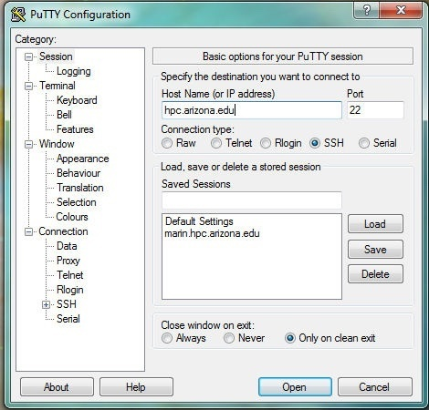
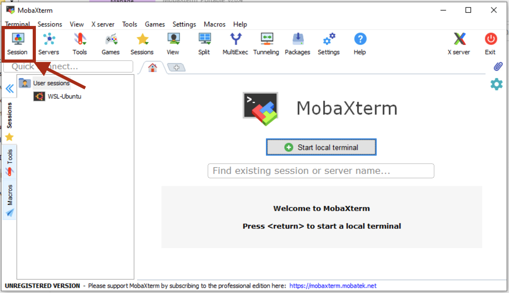
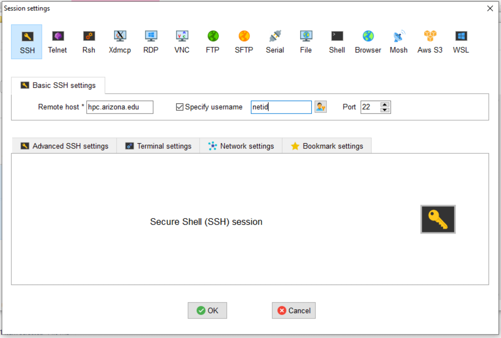

# Command Line Access

???+ tip 
    * **Credentials**: To log into HPC, you will need NetID+ enabled, an HPC account, and internet access. Because we require Duo-authentication to access the system, no VPN is required. 
    * **Password Visibility**: When entering your password in the terminal at the prompt, you will not see any characters appear on the screen while typing during this step. This is normal and everything is working as it should.


=== "Linux/Mac"
    ???+ tip
        Mac systems provide a built-in SSH client, so there is no need to install any additional software. You will find the terminal application under Applications → Utilities → Terminal.
        
    Open the terminal and enter:
    ```bash
    $ ssh netid@hpc.arizona.edu
    ```
    where netid is your UArizona NetID. When you press enter, you will be prompted for your university password. After successfully entering your password, you will be prompted to Duo Authenticate. If everything is successful, you will be connected to the bastion host.

=== "Windows"
     Windows systems do not have any built-in support for using SSH, so you will have to download a software package to do so. There are several available for Windows workstations.  Free SSH clients are available for download from the University of Arizona's [Site License website](https://uarizona.service-now.com/sp?id=sc_cat_item&sys_id=26fe95e12f309150a55e95acf699b686&sysparm_category=4bced1e12f309150a55e95acf699b6ad).  
        
    === "PuTTY"
        PuTTY is the most popular open source SSH Windows client. To use it: download, install, and open the [Putty client](https://www.putty.org/). Next, open a connection and enter ```hpc.arizona.edu``` under **Host Name** and press **Open**
            
        
            
        This will open a terminal. At the prompt, enter the following, replacing ```<netid>``` with your own NetID:
            
        ```bash
        Login as: <netid>
        ```
            
        You will then be prompted to Duo-Authenticate. If the process is successful, you will be connected to the bastion host.
        
    === "MobaXterm"
        MobaXterm is another available SSH Windows client. To connect to HPC, [download and install MobaXterm](https://mobaxterm.mobatek.net/download.html), open the software, select **Session → SSH** and enter ```hpc.arizona.edu``` under **Remote host**. Next, select the box next to **Specify username** and enter your UArizona NetID. To connect, click OK at the bottom of the screen:
            
        
            
        This will open a terminal and will prompt you for your UArizona password. You will then need to Duo-authenticate. If everything is successful, you will be connected to the bastion host.
        
        
Once you reach the bastion host, regardless of method, you should see the following:
```
Success. Logging you in...
Last login:
This is a bastion host used to access the rest of the RT/HPC environment.
   
Type "shell" to access the job submission hosts for all environments
```
From there, type ```shell``` to connect to the login nodes that will provide access to our three clusters. On the login nodes, you should see:
```bash
***
The default cluster for job submission is Puma
***
Shortcut commands change the target cluster
-----------------------------------------
Puma:
$ puma
(puma) $
Ocelote:
$ ocelote
(ocelote) $
ElGato:
$ elgato
(elgato) $
-----------------------------------------
```
    
    