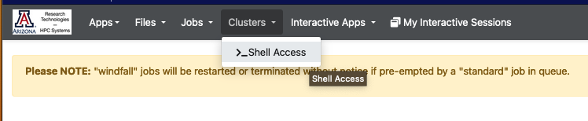
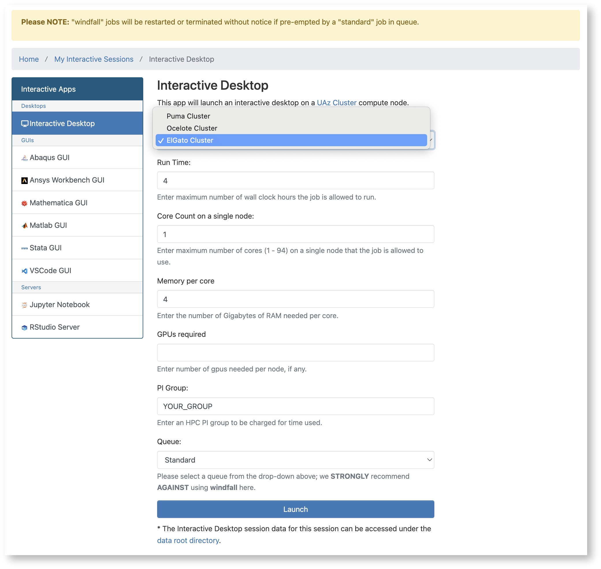
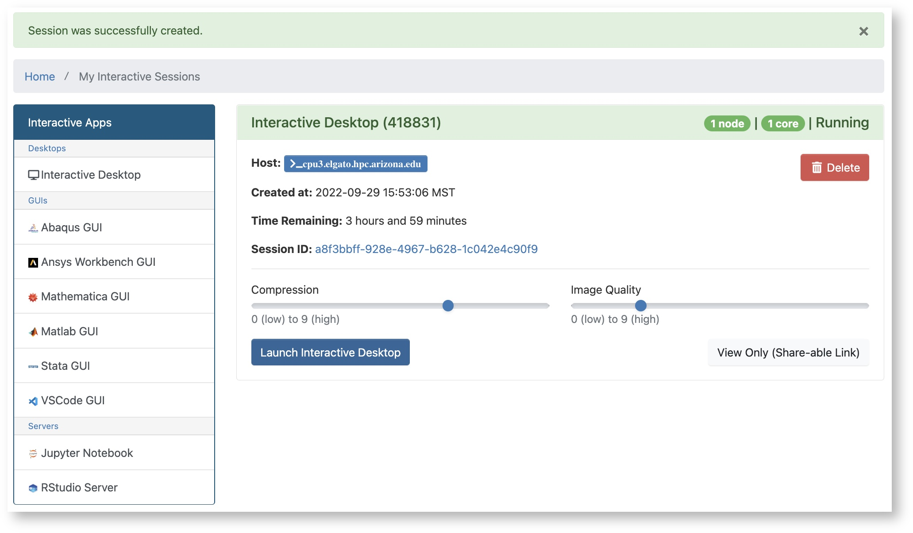
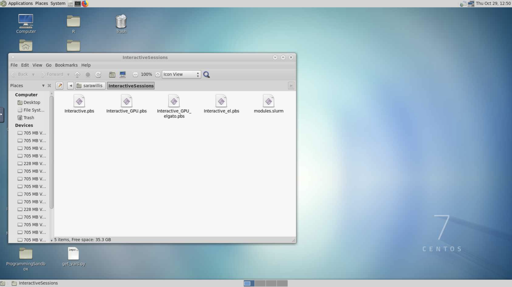

# Web Access

<center>[Open OnDemand](https://ood.hpc.arizona.edu){ .md-button }</center>


=== "Browser Terminal"


    Users can gain command line access to HPC through our OOD web interface as an alternative to using a local SSH Client. To use this interface:

    1. Log into [Open OnDemand](https://ood.hpc.arizona.edu/)
    2. Go to the dropdown menu at the top of the screen and select ```Clusters```
    3. Click ```>_Shell Access```
    
        
        
    4. This will put you on the command line on one of the login nodes where you may perform regular housekeeping work, submit jobs, or request an interactive session. By default, you will automatically be connected to Puma. To navigate to a different cluster, use the displayed shortcuts. 
        
=== "Virtual Desktop"
    Users may also interact with a cluster using a virtual desktop interface. To do this:

    1. Log into [Open OnDemand](https://ood.hpc.arizona.edu/) and, under My Interactive Sessions, select Interactive Desktop under Desktops on the left-hand side of the page.
        
    2. A form will appear where you will select the target cluster, enter the amount of time you'd like to be allotted (in hours), the number of cores you need, your PI Group (if you are unsure what your group name is, you can check in https://portal.hpc.arizona.edu/portal/), and the queue. Once you've filled in your request, click Launch.
        
        
        
    3. A window will appear with the status of your request. It will start in a Pending state and will switch to Running when your desktop session is ready. Click Launch Interactive Desktop to access your session.
        
        
        
    4. That's it! You can now use the cluster with a Desktop interface
        
        