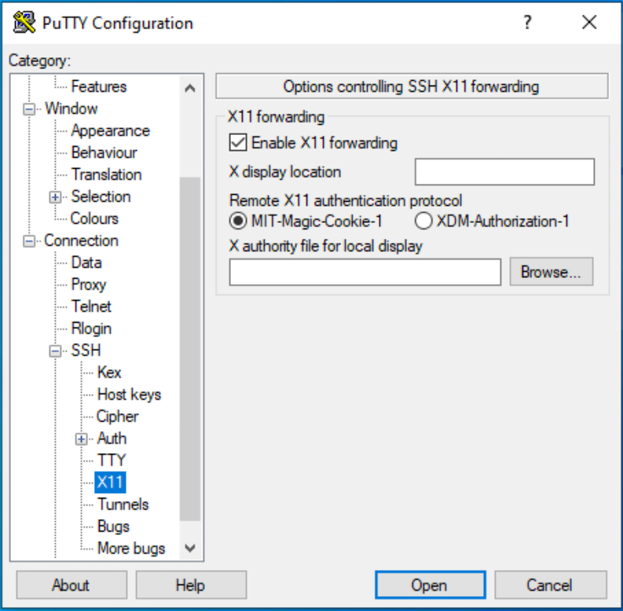
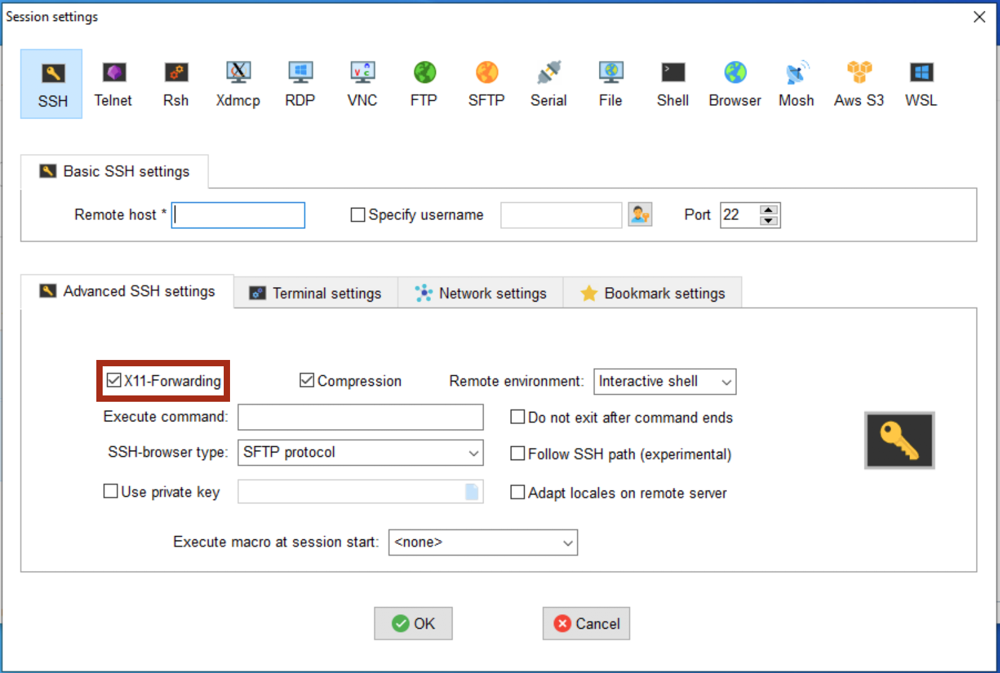

# X11 Forwarding

X11 forwarding is a mechanism that allows a user to start up a remote application (e.g. VisIt or Matlab) and forward the application display to their local machine. The key to make forwarding work successfully is to include the ```-X``` flag at each login step. To check whether X11 forwarding is active, you may run the command:

```bash
$ echo $DISPLAY
```
If it comes back blank, X11 forwarding is not enabled.


=== "Mac/Linux"
    ???+ tip "Tips"
        *  Mac users will want to install the additional software package XQuartz onto their machines to use X11 forwarding with HPC. 
            
        * On a Mac, if you get a blank response to ```echo $DISPLAY```, you might need this line in your ```~/.ssh/config``` file: ```ForwardX11Trusted yes```
   
        * Be aware forwarding X traffic does not work with the DEPRECATED menu interface enabled.  You should disable the menu option and use the hostname shortcuts instead.
    Start a terminal session and connect as you typically would with an additional flag ```-X``` in your ssh command. Once you're connected to the bastion host, enter the name of the cluster you want to access, including the additional ```-X``` flag again. An example of this process is provided below:
    ```bash
    $ ssh -X netid@hpc.arizona.edu
    Password:
    Duo two-factor login for netid
    Enter a passcode or select one of the following options:
 
    1. Duo Push to XXX-XXX-8969
    2. Phone call to XXX-XXX-8969
    3. Phone call to XXX-XXX-0502
    4. SMS passcodes to XXX-XXX-8969
 
    Passcode or option (1-4): 1
    Success. Logging you in...
    Last login:
    This is a bastion host used to access the rest of the RT/HPC environment.
  
    Type "shell" to access the job submission hosts for all environments
    -----------------------------------------            
    [netid@gatekeeper ~]$ echo $DISPLAY
    localhost:13.0
 
    [netid@gatekeeper ~]$ shell -X
    ***
    The default cluster for job submission is Puma
    ***
    Shortcut commands change the target cluster
    -----------------------------------------
    Ocelote:
    $ ocelote
    (ocelote) $
    Puma:
    $ puma
    (puma) $
 
    (puma)[netid@junonia ~]$ echo $DISPLAY
    localhost:18.0
    ```
=== "Windows"
    To use X11 forwarding on a Windows system, you will need to download an X11 display server such as Xming. 
        
    === "PuTTY"
        To enable X11 forwarding in PuTTY, go to SSH → X11 and select the box next to Enable X11 forwarding.
            
        
            
        Once you've connected to the bastion host, connect to the login nodes with the an additional flag ```-X```:
            
        ```bash
        shell -X
        ```
    === "MobaXterm"
        To enable X11 forwarding in MobaXterm, open a new session, select **SSH**, and open **Advanced SSH settings**. Select the option below called **X11-Forwarding**.
            
        
            
        Once you've connected to the bastion host, connect to the login nodes with the an additional flag ```-X```:
        ```bash
        shell -X
        ```