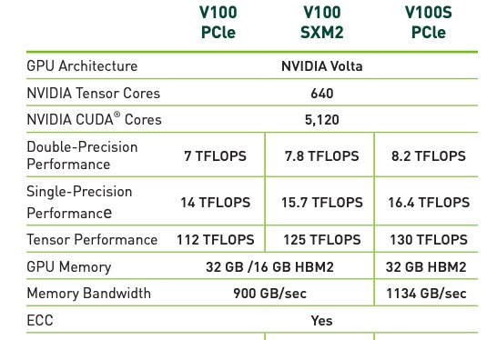
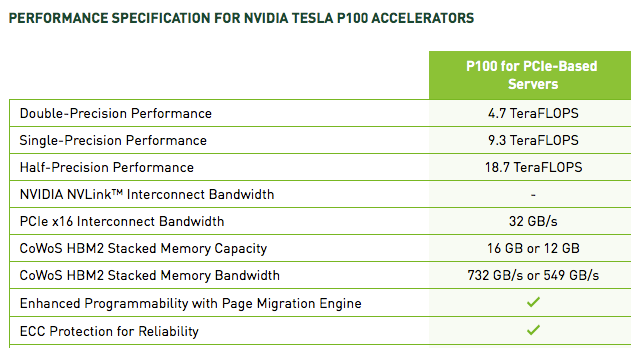
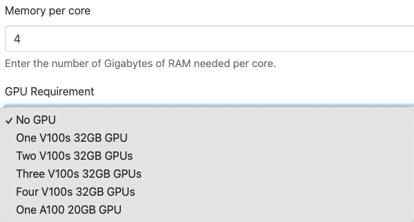

# GPU Nodes

## Resources by Cluster

=== "Puma"
    
    Puma has a different arrangement for GPU nodes than Ocelote and ElGato. Whereas the older clusters have one GPU per node, Puma has four. This has a financial advantage for providing GPU's with lower overall cost, and a technical advantage of allowing jobs that can use multiple GPU's to run faster than spanning multiple nodes.  This capability comes from using a newer operating system.  
    
    Each node has four Nvidia V100S model GPUs. They are provisioned with 32GB memory compared to 16GB on the P100's.  

=== "Ocelote"
    
    Ocelote has 46 compute nodes with Nvidia P100 GPUs that are available to researchers on campus. The limitation is a maximum of 10 concurrent jobs. Previously, one node with a V100 was available, but it has since been replaced with a P100. Tasks which require multiple GPUs must either request multiple nodes on Ocelote, or use Puma's GPU nodes.

=== "ElGato"
    ElGato has no GPU nodes. During the quarterly maintenance cycle on April 27, 2022 the ElGato K20s and Ocelote K80s were removed due to no longer being supported by Nvidia.

## CUDA Modules


## OpenACC

## MIG (Multi-Instance GPU) Resources

### Overview

The Four A100 GPUs on Puma Node r5u13n1 are each subdivided into 3 smaller virtual GPUs using the Nvidia MIG (Multi-Instance GPU) method.  Each of these MIG slices allows the use of 20 GB of GPU memory.  The vast majority of jobs run on Puma in 2023 used less than this amount of GPU memory.  The  12 MIG GPUs  will increase overall GPU availability on Puma by freeing the 32 GB V100 GPUs for users requiring larger amounts of GPU memory.

Jobs requesting MIG resources will ideally be scheduled more quickly than those requesting the standard V100 GPUs, so MIG resources should be preferred when sufficient.

A limitation is that only one MIG slice can be addressed by a single application, so MIG slices are not  appropriate for jobs utilizing multiple GPUs.

### Using MIG Resources

The addition of the MIG devices to the SLURM queues will have a number of impacts, and some users may need to make changes to submissions to ensure proper functioning of analyses.

#### Batch Jobs
Typically, in batch scripts $N$ GPUs are requested by including the Slurm directive

```
#SBATCH --gres=gpu:N
```

With the inclusion of MIG GPU resources, the GPU resources allocated by the above directive may be either MIG slices or V100 GPUs, depending on which resources are available. 

To explicitly request a V100, use the directive:

```
#SBATCH  --gres=gpu:volta:N
```

To explicitly request a MIG slice, use the directive:

```
#SBATCH --gres=gpu:nvidia_a100_80gb_pcie_2g.20gb                                                               
```


#### Open OnDemand Applications

The Open on Demand job request form includes a dropdown menu that allows the choice of appropriate GPU resources.  On Puma these include selections for 1-4 V100 GPUs or a MIG slice(One A100 20GB GPU), as seen here:



#### Interactive Terminal Jobs

The command “interactive” does not currently allow the selection of MIG resources, but a MIG slice can be requested with an salloc command similar to this:

```
salloc --gres=gpu:nvidia_a100_80gb_pcie_2g.20gb --job-name=interactive --mem-per-cpu=#GB --nodes=1 --ntasks=# --time=### --partition=<partition name>  --account=<account name>
```