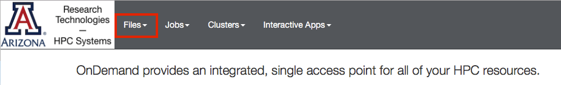
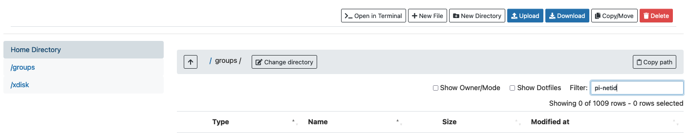
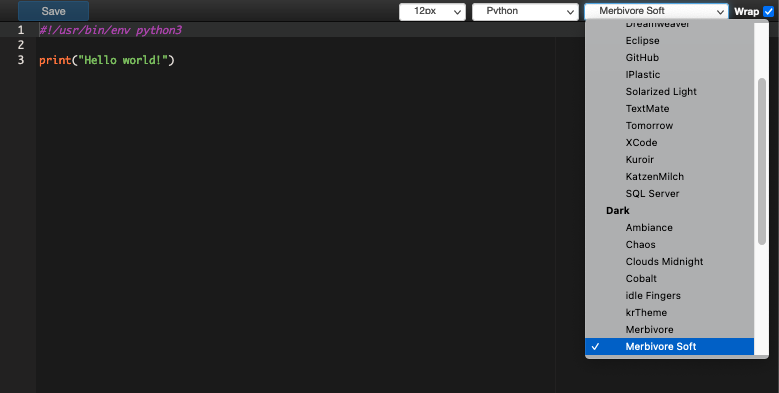

<button class="collapsible">Access</button>

    
In the browser at the top of the screen, select the Files dropdown

    

    
You will be able to select your home directory, /groups, or /xdisk. If you select /groups or /xdisk, enter your PI's NetID in the Filter field to find your shared group space.

    

<button class="collapsible">Editing Files</button>

    
First, navigate to the file you wish to edit. Then, click the vertical ellipses on the right-hand side and select Edit

    

    

This will open a file editor in your browser where you may select your color theme, text size, and syntax highlighting.
    

<button class="collapsible">Uploading/Downloading Files</button>

    
<mark style = "background-color:#a8ffa8"><b>Note:</b> <i>The OnDemand file manager is a quick easy way to transfer small files (<1GB). For larger files, see: <a href="../../storage_and_transfers/transfers/overview">Transferring Data</a></i></mark>

    
<b>Uploading Files</b>

    
In the file browser, navigate to the directory where you would like to upload your files, then select "Upload" :

    

    
This will bring up a popup where you can open a file browser to search for your files. Alternatively, you can drag/drop files/directories onto the tile.

    

    
<b>Downloading Files</b>

    
To download small files from your HPC account to your local workstation, navigate to the file(s) you'd like to to transfer and check the box(es) on the left. Clicking download will initiate the transfer to your local Downloads directory.

    

