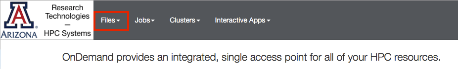
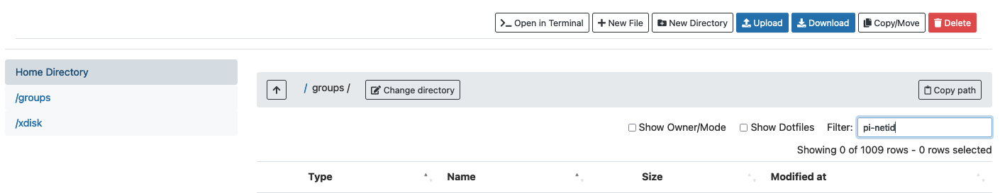
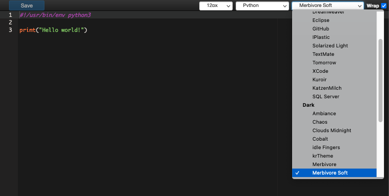
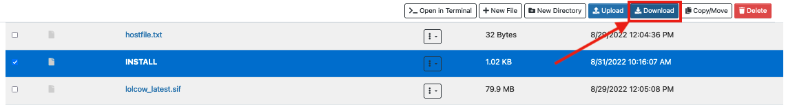

# File Browser

The file browser provides easy access to your ```/home```, ```/xdisk```, and ```/groups``` directories and allows you to view, edit, copy, and rename your files. You may also transfer small files between HPC and your local workstation using this interface. For larger transfers, see our section on [Transferring Data](../../../storage_and_transfers/transfers/overview/) for more efficient methods.

## Access

In the browser at the top of the screen, select the Files dropdown



You will be able to select your home directory, ```/groups```, or ```/xdisk```. If you select ```/groups``` or ```/xdisk```, enter your PI's NetID in the Filter field to find your shared group space.



## Editing Files


First, navigate to the file you wish to edit. Then, click the vertical ellipses on the right-hand side and select Edit


This will open a file editor in your browser where you may select your color theme, text size, and syntax highlighting. To save your changes, click Save in the upper left side of the screen




## Transferring Files

### Uploading Files

In the file browser, navigate to the directory where you would like to upload your files, then select "Upload".  


This will bring up a popup where you can open a file browser to search for your files. Alternatively, you can drag/drop files/directories onto the tile.


### Downloading Files

To download small files from your HPC account to your local workstation, navigate to the file(s) you'd like to to transfer and check the box(es) on the left. Clicking download will initiate the transfer to your local Downloads directory.

