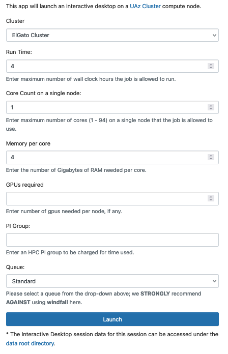
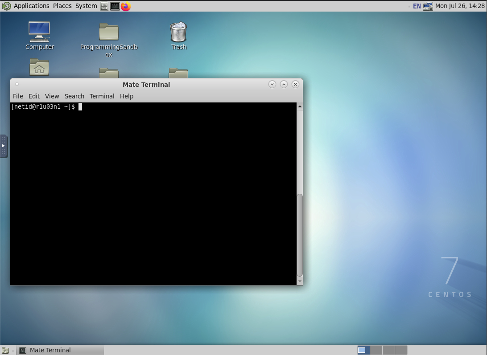
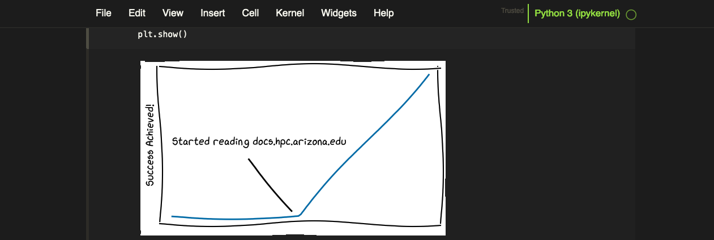
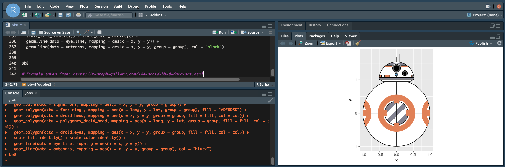
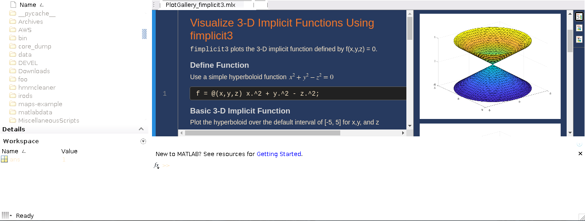
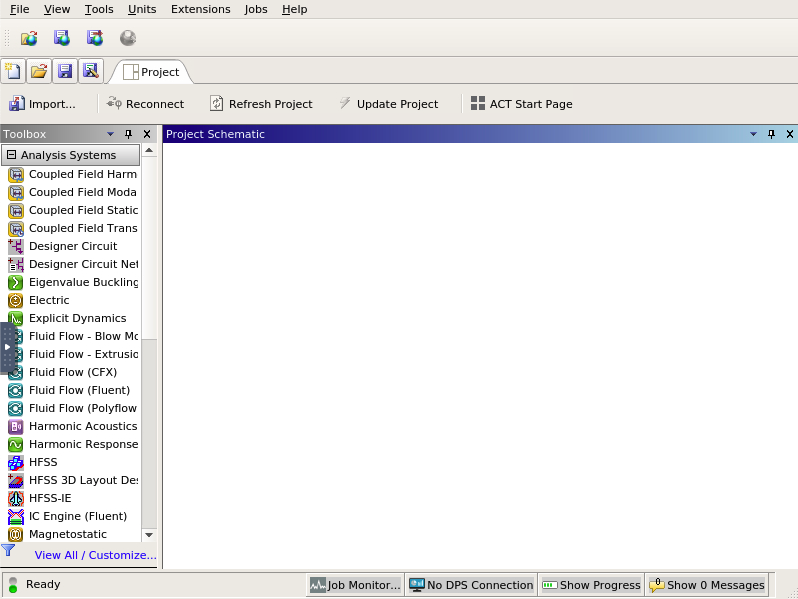
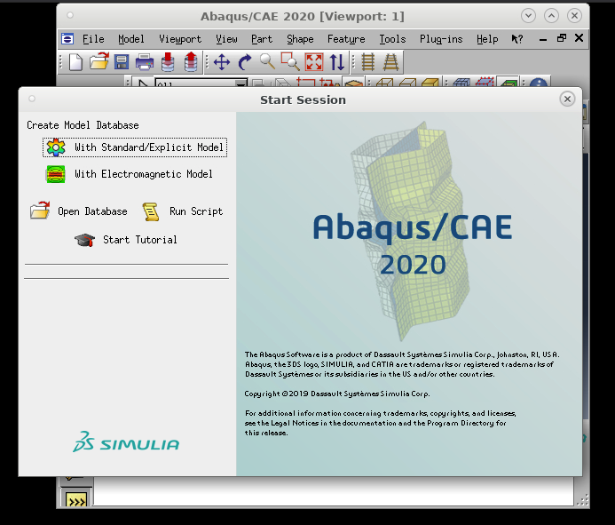

# Interactive Graphical Applications

## Overview

Open OnDemand provides access to graphical interfaces for some popular software. These can be found under Interactive Apps through the Open OnDemand web browser. The process of starting and accessing these applications is the same. 

## Web Form

First, select the desired application from Interactive Apps. This will take you to a form where you will enter your job information. This includes the entries in the following table:



|Field|Description|
|-|-|
|Cluster|Select which cluster to submit the job request to.|
|Run Time|The maximum number of hours the job can run. Please note that the maximum possible run time is 10 days (240 hours).|
|Core Count on a Single Node|The number of CPUs needed. This affects the amount of memory your job is allocated. The maximum that can be requested is [dependent on which cluster you choose](../../../resources/compute_resources/compute_resources/).|
|Memory per Core|The amount of memory needed per core. The amount that can be requested is dependent on which cluster you choose and your desired node type. Warning: if you request more than is available on a standard node, [you may be allocated a high memory node](../../../resources/compute_resources/job_memory_and_cpu_count/). The wait times for these machines can be significantly longer.|
|GPUs Required|The number of GPUs needed for your job, if any. This field may be left blank or set to 0 if no GPU is desired. Up to 4 may be requested on a single Puma node, 1 may be requested on Ocelote, and 0 on ElGato.|
|PI Group|Your accounting group. If you do not know your group name, you can either check in the user portal, or can run ```va``` on the command line. If the group you entered does not exist, you will receive an error "sg: group 'foo' does not exist"|
|Queue|The queue, or partition, to use. Standard is the most common. If your group has buy-in hours, you may use High Priority.|

Once you've entered all your details, click Launch at the bottom of the page. This will take you to a tile with information about your job including job ID and session ID. This information can used for debugging purposes.

When you first submit your job, it will show as having a status of "Queued". Once your job reaches the front of the queue, it will show a status of "Starting". When your session is ready, you can launch the application using Connect at the bottom of the tile.

## Applications Available

=== "Virtual Desktop"
    One nice feature of Open OnDemand is the ability to interact with HPC using a virtual Desktop environment. This provides a user-friendly way to run applications, perform file management, and navigate through your directories as though you were working with a local computer. Additionally, it eliminates the need to use [X11 forwarding](../../../registration_and_access/system_access/x11_forwarding/) when working with GUI applications allowing an easy way to interact with software such as Matlab, VisIt, or Anaconda.

    

=== "Jupyter Notebooks"
    !!! tip
        To access your own python packages in Jupyter, you can create custom kernels either using [a python module](../../../software/popular_software/python_and_anaconda/python/#custom-jupyter-kernel) or [using anaconda](../../../software/popular_software/python_and_anaconda/anaconda/#custom-jupyter-kernel). 

    The Jupyter Notebook is an open-source web application that allows you to create and share documents that contain live code, equations, visualizations, and narrative text. 

    When you start a Jupyter notebook, by default your working directory will be your home. If you would like to change this so that your session starts in a different location, you'll need to add a line to the hidden file ~/.bashrc in your home. To do this, open your ~/.bashrc in a text editor and add the following, substituting your desired path in for /path/to/directory:

    ```
    export NOTEBOOK_ROOT=/path/to/directory
    ```

    


=== "Rstudio"

    RStudio is an integrated development environment (IDE) for R. It includes a console, syntax-highlighting editor that supports direct code execution, as well as tools for plotting, history, debugging and workspace management. For an overview of the RStudio IDE, see: [https://www.rstudio.com/products/RStudio/](https://www.rstudio.com/products/RStudio/).

    For information on using R on HPC, see our [online documentation on Using R Packages](../../../software/popular_software/R/).

    

=== "Matlab"

    A GUI for multiple versions of Matlab is available. You can select which version to use in the web form when specifying your resources.

    

=== "Ansys"
    Multiple versions of the [engineering application Ansys](https://www.ansys.com/) are available. You can specify which version to use in the web form when specifying your resources. To receive Ansys-specific support, see: [Community and External Resources](../../../support_and_training/external_resources/#ansys)

    

=== "Abaqus"
    A GUI for [Abaqus](https://www.technia.us/software/simulia/abaqus/) is available. 
    
    