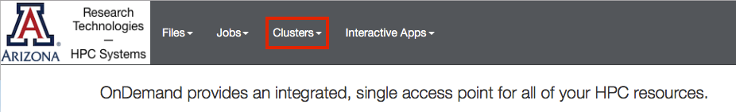

# Open OnDemand

## Overview

Open OnDemand, which is an NSF-funded open-source HPC portal, is available for users and provides web browser access for interfacing with HPC. 
[Open OnDemand](https://ood.hpc.arizona.edu/pun/sys/dashboard){ .md-button .md-button--primary }

## Command Line Access

Need command line access to a terminal on HPC? No problem! Simply select the Clusters dropdown menu to connect to one of HPC's login nodes. This is also detailed under [System Access](/registration_and_access/system_access/#web-access)



## File Browser

The file browser provides easy access to your ```/home```, ```/xdisk```, and ```/groups``` directories and allows you to view, edit, copy, and rename your files. You may also transfer small files between HPC and your local workstation using this interface. For larger transfers, see our section on Transferring Data for more efficient methods. 

=== "Access"

=== "Editing Files"

=== "Uploading/Downloading Files"

## Job Viewer and Composer

## Interactive Graphical Applications


