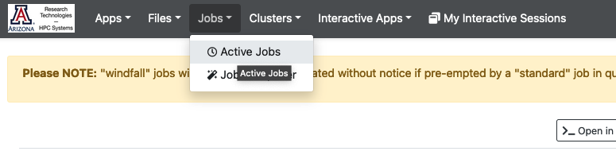
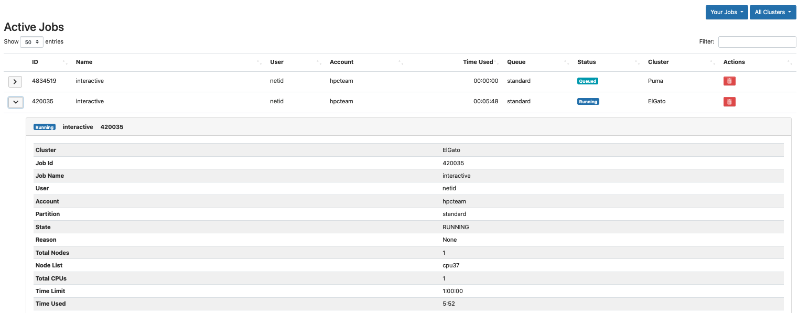
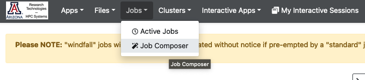

# Job Viewer and Composer

## Job Viewer

The Job Viewer allows you to check the status and time remaining of your running jobs. You can also cancel your jobs using this interface. Note: be careful looking at All Jobs since this will likely timeout trying to organize them all. To use the Job Viewer, navigate to the Jobs dropdown and select Active Jobs.

This will open a new page listing all your running and pending jobs. You may delete them by clicking the red trash icon under Actions, or view more information about individual jobs using the dropdown on the left next to the ID.

## Job Composer

The Job Composer lets you create and run a SLURM script on any of our three clusters. It should be noted that the Job Composer creates a special string of directories in your /home starting with ondemand/ which is where both your submission scripts and output files will be stored. Make note of the path to your files on the right-hand side of the Job Composer screen under Script location.

