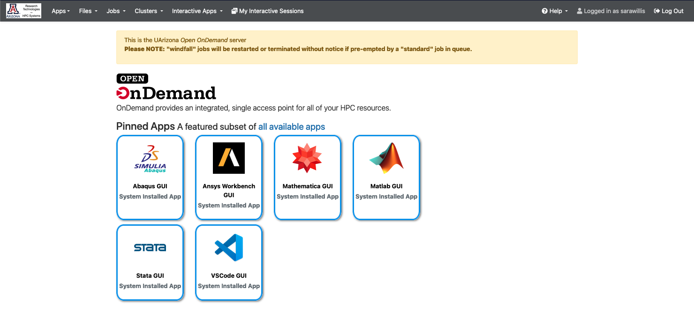

# Open OnDemand

[Open OnDemand](https://ood.hpc.arizona.edu/pun/sys/dashboard){ .md-button .md-button--primary }

Open OnDemand is an NSF-funded open-source HPC portal. This web interface is available for users to interact with HPC providing shell access, file management capabilities, and access to graphical applications.

