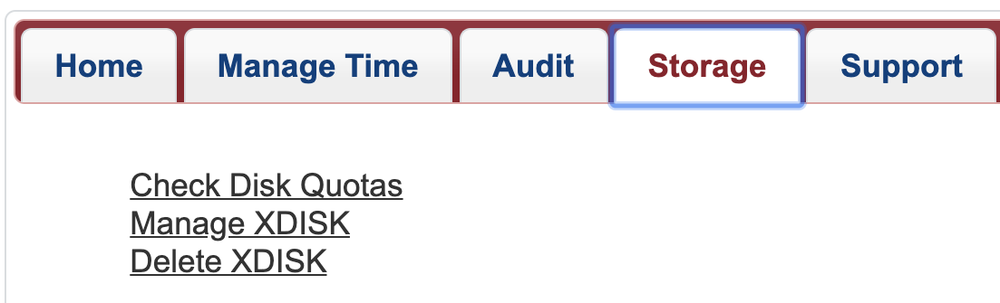

# Checking Your Storage Usage

=== "Command Line"
    To check your storage usage, on a compute node, file transfer node, or login node, use the command ```uquota```. This will show you all the spaces you have access to, their quotas, and current usage.
    ```
    (puma) [netid@junonia ~]$ uquota
                                            used  soft limit  hard limit
    /groups/pi_netid                            6.6G      500.0G      500.0G
    /home                                      37.1G       50.0G       50.0G
    /xdisk/pi_netid                            12.9G        9.8T        9.8T
    ```
    
=== "User Portal"
    You can check your storage allocation through our [online user portal](https://portal.hpc.arizona.edu/portal/) by navigating to the Storage tab and clicking Check Disk Quotas:
    
    
    
