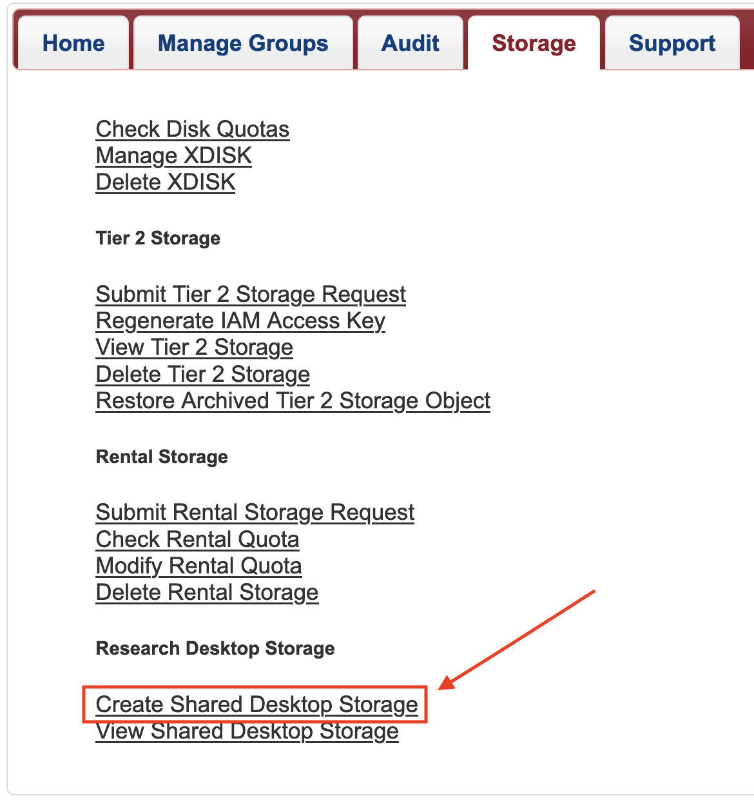
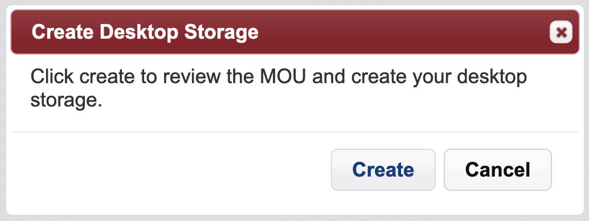
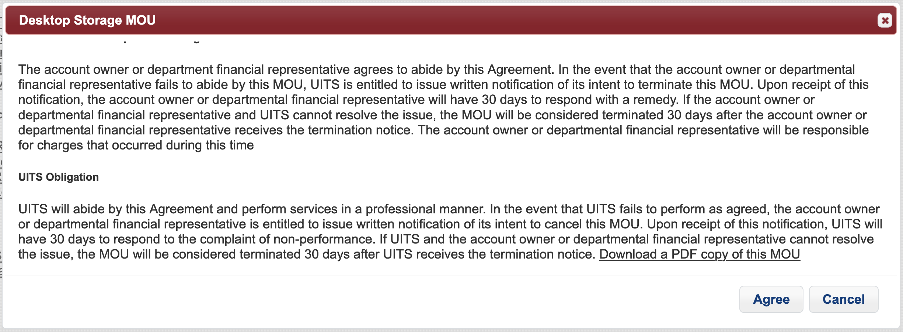
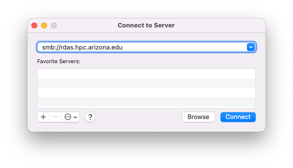
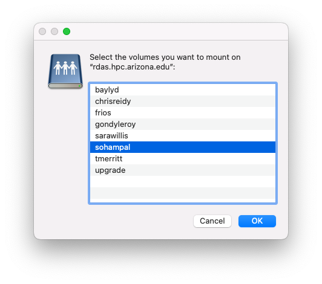

# Research Desktop Attached Storage (R-DAS)

## Overview

!!! danger "Notice"
    R-DAS storage is not mounted on HPC compute or login nodes.
    
!!! tip
    Group Sharing: Faculty members/PIs can share their allocations with group members. To do so, in step 6 in the **Accessing Your R-DAS Allocation" section below, group members will choose the allocation with their faculty member's/PI's NetID.

On October 16, 2023, we went live with the Research Desktop Attached Storage Array (R-DAS). R-DAS provides up to 5 TB of no-cost storage capacity for each PI group. Our requirement was to enable our users to easily share data with other research group members. You can treat the allocation as a drive mounted on your local computer. R-DAS is intended for storing open research data, but not controlled or regulated data.

## Technical Requirements

R-DAS is a storage service backed by a Qumulo branded storage array. It supports the mounting of SMB shares for SMB 3.1. The supported operating systems are MacOS (Monterey or higher), Linux (kernel 3.7 or higher), and Windows (Windows 10 or 11).

## Performance

The storage array is located in the Research Data Center to benefit from the network infrastructure in the Computer Center. The performance you experience will depend on your network connectivity. The best case is likely wired ethernet in a newer building. Off campus usage requires connection to the VPN, and so performance can be variable. Our testing off campus regularly reached 3 MB/s.

## Requesting an Allocation

PIs can request an allocation on R-DAS from [https://portal.hpc.arizona.edu/portal](https://portal.hpc.arizona.edu/portal)

1. Go to the **Storage** tab
2. Select **Create Shared Desktop Storage** under **Research Desktop Storage**

    
    
3. Select **Create** from the window that opens. 
      
    
    
4. A window will open with the MOU agreement. Review it and, if it is acceptable to you, select **Agree**.

    
    
5. You can now select the **View Shared Desktop Storage** option from the main **Storage** page in the user portal

    
    
## Accessing Your R-DAS Allocation
!!! tip
    UA IP Address Required: To access your R-DAS allocation you need to be connected to either the UA campus network, or the UA SSL VPN. For information about connecting to a VPN, see [VPN - Virtual Private Network](registration_and_access/vpn/). If you are accessing your R-DAS allocation from an HPC cluster, then you are already on the UA campus network and do not need to connect to the UA SSL VPN. 
    
R-DAS can be accessed from Linux, MacOS, or Windows. The screenshots are intended to be visual aids, but they include information from the consulting team. When you proceed, please enter your own information.


!!! example "Choose your operating system"

    === "Linux/HPC"
        !!! tip
            To connect to R-DAS from HPC, do not attempt to run ```sudo``` commands, these are only meant for your personal Linux machines. All required packages are already installed on the HPC clusters.
            
        First, install the necessary software packages to access your allocation
        
        !!! example "Choose your distribution"
            === "Debian/Ubuntu"
                ```bash
                sudo apt install samba gvfs-backends smbclient
                ```
            === "Fedora/CentOS"
                ```bash
                sudo yum install samba gvfs-samba samba-client 
                ```
            === "Other Linux Distributions"
                Please check the documentation of your distribution.
        
        Next, access your allocation
        !!! example "Choose your connection method"
            === "GUI"
            
            === "CLI"

    === "Mac OS"
        If you are on a Mac, then you can mount your R-DAS allocation as a local drive with the following steps:
    
        1. Go to Finder
        2. Select **Go** from the top menu bar.
        3. From the drop-down menu, select **Connect to Server**.
        4. In the window that opens, enter ```smb://rdas.hpc.arizona.edu``` in the address bar, and select **Connect**.
    
            
        
        5. After a few moments a window opens prompting for your **Name** (UA NetID) and **Password** (UA NetID password). After entering the details, select Connect.
    
            
    
        6. A window will open with the list of allocations on the array. Select the allocation named after your group, and then select **OK**.

            
        
        
    === "Windows"


## FAQs
For any questions about R-DAS, see our [Storage FAQs page](support_and_training/faqs/storage/) for some common issues. 
