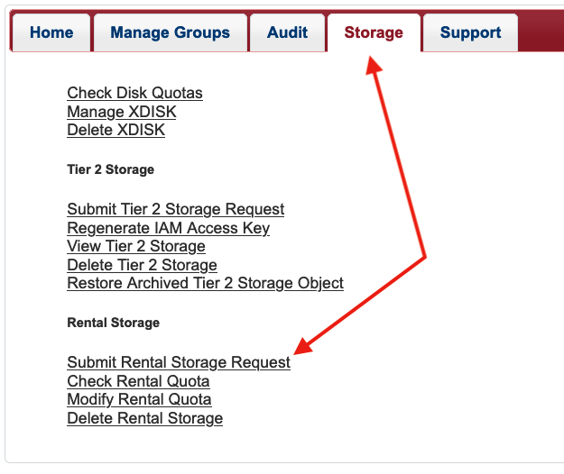
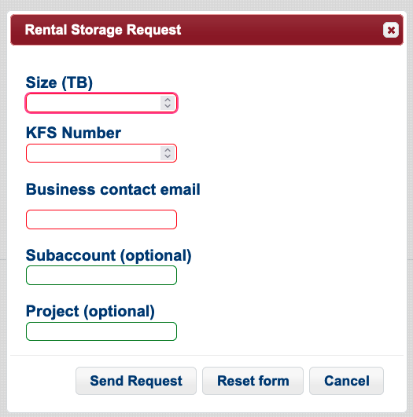

# Rental Storage

## Overview

!!! danger
    Your ```/rental``` allocation is only mounted on our Data Transfer Nodes and is not directly accessible from the HPC login or compute nodes. 

The storage we offer is configured with consideration given to the direct relationship between capacity, performance and cost. We offer a rental storage solution that has less performance and so is affordable for researchers to rent. This storage array is located in the Research Data Center and is mounted on our data transfer nodes which makes it more accessible than most other options. Data in your rental space will be accessible via the command line and the graphical transfer application Globus. 


## Pricing

### Cost per Year

The first-year rate is $94.50 per TB, and RII will provide matching funds for first-year allocations to make the actual first-year cost to researchers $47.35. These matching funds will be applied automatically, so in practice you will only see the $47.35 rate. The ongoing rate after year one is $47.35 per TB per year.

### Billing
Researchers must provide a KFS account for this service. Charges will be applied at the end of the academic year (June).

### Size Modifications

If the size of your allocation is modified, you will be billed for the maximum amount of space reserved during that fiscal year. 


## Data Location

!!! danger
    Your ```/rental``` allocation is only mounted on our Data Transfer Nodes and is not directly accessible from the HPC login or compute nodes. 


Your rental space will be on a storage array in our Research Data Center and mounted on our data transfer nodes (hostname: ```filexfer.hpc.arizona.edu```). Your space will be findable under 

```bash
/rental/<pi_netid>
```

Where ```<pi_netid>``` is the NetID of the faculty member who requested the allocation.

## Data Transfers

A few data transfer options are Globus, ```sftp```, and ```scp``` which will allow you to move data external to the data center to your allocation.

For data transfers between HPC storage (```/home```, ```/groups```, or ```/xdisk```) and your rental allocation, you may also ```ssh``` into ```filexfer.hpc.arizona.edu``` and use ```mv``` or ```cp```. For large copies done using this method, we recommend using a ```screen``` session to prevent timeouts. For example:
```bash
[netid@home ~]$ ssh netid@filexfer.hpc.arizona.edu
Authorized uses only. All activity may be monitored and reported.
Last login: Fri Sep 15 10:53:27 2023
[netid@sdmz-dtn-3 ~]$ cd /rental/pi/netid/example
[netid@sdmz-dtn-3 example]$ screen
[netid@sdmz-dtn-3 example]$ cp -r /xdisk/pi/CONTAINERS/ $PWD/CONTAINERS
[netid@sdmz-dtn-3 example]$ ls
CONTAINERS
[netid@sdmz-dtn-3 example]$ exit # exits screen session
[netid@sdmz-dtn-3 example]$ exit # exits filexfer node
logout
Come again soon!
Connection to filexfer.hpc.arizona.edu closed.
[netid@home ~]$
```

## How to Request Rental Storage

!!! warning
    Allocations up to 20TB in size can be requested through the user portal. For allocations larger than 20TB, [contact our consulting team](http://localhost:6798/support_and_training/consulting_services/) for help.
!!! tip
    It can take a few days to process the request is it has to route through the Financial Services Office (FSO). You will receive an email confirmation once it is complete.

1. PIs or [Group Delegates](registration_and_access/group_management/#delegating-group-management-rights) can request rental storage on behalf of their group. To do so, navigate to the [User Portal](https://portal.hpc.arizona.edu) in your browser, then choose the **Storage** tab

    

2. Select **Submit Rental Storage Request** under the **Rental Storage** heading and fill out the form. 

    

3. Once your space has been created, you will receive an email notification that it is ready for use.


## Resizing Your Allocation
    
