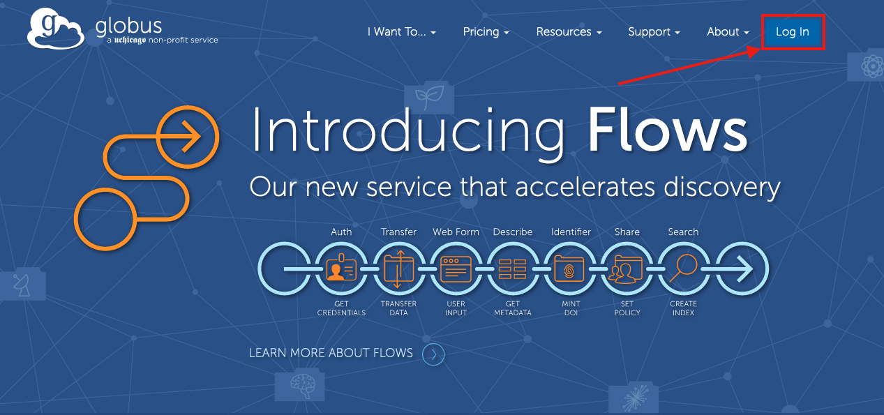
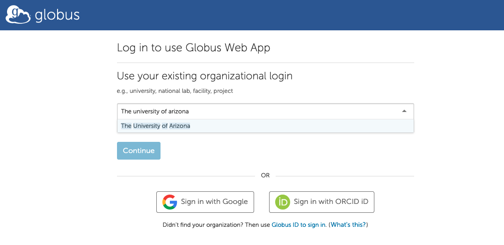
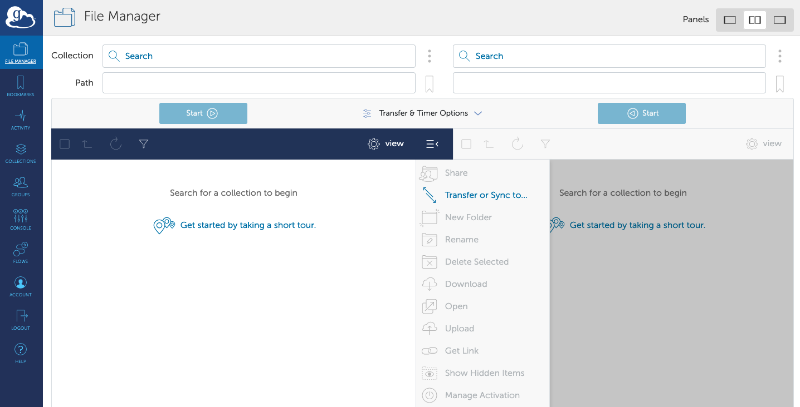

# Globus

## Overview

[Globus](https://www.globus.org/){ .md-button .md-button--primary }

GridFTP is an extension of the standard File transfer Protocol (FTP) for high-speed, reliable, and secure data transfer. Because GridFTP provides a more reliable and high performance file transfer (compared to protocols such as SCP or rsync), it enables the transmission of very large files. GridFTP also addresses the problem of incompatibility between storage and access systems. (You can read more about the advantages of GridFTP [here](https://en.wikipedia.org/wiki/GridFTP)).

To use GridFTP, we recommend you use Globus. Globus uses endpoints to make transfers. 

## Accessing Globus
Globus can be used as a web application. To access it, go to [https://www.globus.org/](https://www.globus.org/). Next, click **Log In** in the upper right-hand corner

On the next page, enter **The University of Arizona** in the search field and click the result.

This will take you through the standard university WebAuth login process. Once you successfully log in, you will be placed in a File Manager window. The various steps for setting up endpoints, initiating transfers, and viewing a transfer's progress can be found in the sections below.

