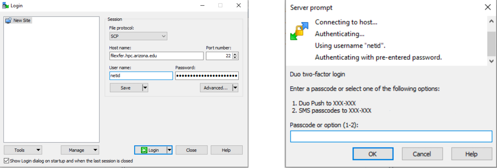

# SCP

SCP uses Secure Shell (SSH) for data transfer and utilizes the same mechanisms for authentication, thereby ensuring the authenticity and confidentiality of the data in transit.

## Mac/Linux

You will need to use an SSH v2 compliant terminal to move files to/from HPC. For more information on using SCP, use man scp.

### Moving a File or Directory to HPC

In your terminal, navigate to the desired working directory on your local machine (laptop or desktop usually). To move a file or directory to a designated subdirectory in your account on HPC:

```bash
scp -rp filenameordirectory NetId@filexfer.hpc.arizona.edu:subdirectory
```

### Downloading a File or Directory from HPC

!!! tip
    The space folllowed by a period at the end of the command below means the destination is the current directory

In your terminal, navigate to the desired working directory on your local machine. The copy a remote file from HPC to your current directory:
```bash
scp -rp NetId@filexfer.hpc.arizona.edu:filenameordirectory .
```

### Wildcards

Wildcards can be used for multiple file transfers (e.g. all files with .dat extension). Note the backslash ```\``` preceding ```*```

```bash
scp NetId@filexfer.hpc.arizona.edu: subdirectory /\*. dat
```

## Windows

Windows users can use software like WinSCP to make SCP transfers. To use WinSCP, first download/install the software from: [https://winscp.net/eng/download.php](https://winscp.net/eng/download.php)

To connect, enter ```filexfer.hpc.arizona.edu``` in the **Host Name** field, enter your **NetID** under **User name**, and enter your password. Accept by clicking **Login**. You'll be prompted to Duo Authenticate:

