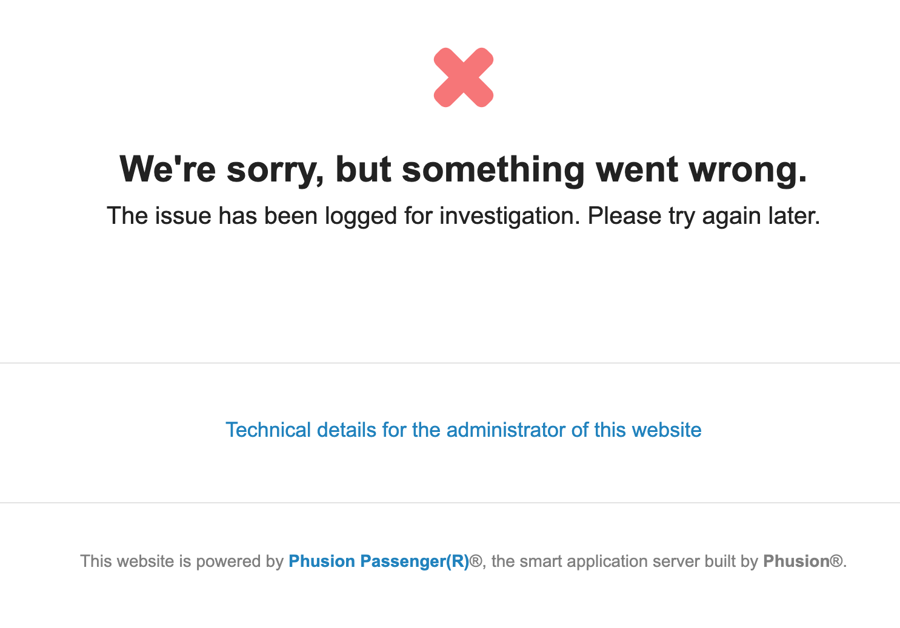

# Open OnDemand Issues


<link rel="stylesheet" href="../../../overrides/animated_dropdown.css">
<link rel="stylesheet" href="../../../overrides/spacing.css">

<html>
    
<button class="collapsible">Foo?</button>
<div class="content">
  <p>
      Bar!
  </p>
</div>
    
    
<div class="vertical-space"></div>
<script src="../../../overrides/animated_dropdown.js"></script>

</html>


??? question "Why am I getting a message saying I'm not sponsored when trying to log in?"

    If you are trying to log in to Open Ondemand and are seeing the following:
    
    
    
    1. You have not yet been sponsored by a faculty member. See our Account Creation page for instructions on getting registered for HPC.
    
    2. If you are already registered for HPC, this may be a browser issue. Try logging in again in an incognito session or different browser to test. If this succeeds, clearing your browser's cookies should help.
    
??? question "Why am I getting a "Bad Request" message when trying to connect?"
    If you are trying to log in to Open Ondemand and are seeing the following:
    
    
    
    this may be a browser issue. Try logging in again in an incognito session or different browser to test. If this succeeds, clearing your browser's cache should help.
    
??? question "Why am I getting an error saying "We're sorry, but something went wrong" when trying to log in?"
    If you're trying to log into Open OnDemand but are getting an ambiguous error that looks something like the following:
    
    
    
    check your storage usage in your home directory. You can do this by logging into HPC in a terminal session and using the command uquota. If your storage usage is >50GB, OnDemand cannot create the temporary files necessary to give access to the website. Try clearing out some space in your home and then logging back into OnDemand.

??? question "Why are my Desktop sessions failing with 'Could not connect to session bus: failed to connect to socket /tmp/dbus-'?"
    If you're seeing:
    
    
    
    when trying to connect to an interactive desktop session, the likely culprit is Anaconda. For a permanent solution, you can run the following command from an interactive terminal session:
    ```bash
    conda config --set auto_activate_base false
    ```
    This will prevent conda from auto-activating when you first log in and allow you to have more control over your environment. When you'd like to activate anaconda, run conda activate. See this example for information running anaconda workflows in batch with auto-activation disabled.